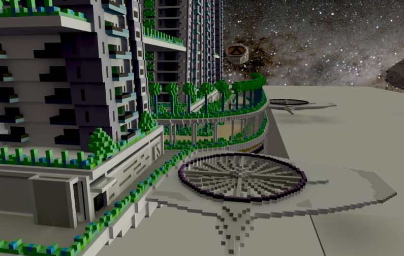

# BRIEF INFO ON THE 2021 WORLD TEMPLATE

Project website: https://jacco.ompf2.com/voxel-world-template/

*Purpose:*

This template has been designed to make it easy to start coding C++
using games and 3D graphics. The world is 3D, but consists of a
finite amount of 'voxels' (3D pixels): exactly 1024x1024x1024 are
available to you. Programming games on this 3D 'screen' closely
resembles how we created games on homecomputers - but without the
now outdated 2D graphics.
At the same time, the template is nothing like large engines, like
Unity and Unreal. You get full control over your machine, and you
are welcome to dive deep into the template code, to change it as
you wish, once you are ready to do so.

*Performance:*

Although the engine is aimed towards basic game development, it comes
with state-of-the-art ray tracing with high performance code for
the latest GPUs as well as older ones. Up to 2 billion rays per
second in non-trivial scenes are possible on a RTX3080Ti GPU - 
but without using RTX. Even a 1080 will do well over half a billion
rays per second. Combined with TAA and global illumination, this
renders your scenes with high fidelity, even at high resolutions.

*Tools:*

Import models created with MagicaVoxel, including animated models.
And if it turns out to be hard to find those .vox files, just
create your own, for example by converting them from .obj files,
using the included tool.

*Copyright*

This code is completely free to use and distribute in any form. Build,
play and sell your game without obstacles.

Utrecht, 2015-2021, Utrecht University 
Breda, 2014 and 2020-2021, NHTV/IGAD/BUAS 
Jacco Bikker 
Report problems and suggestions to bikker.j@gmail.com.

